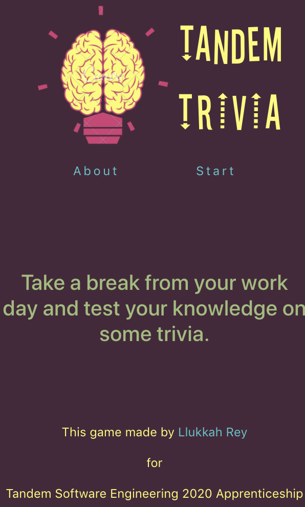
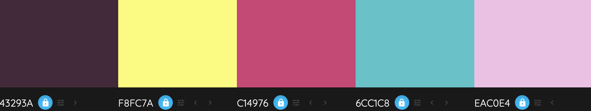

### Description
Take a break from your work day and test your knowledge on some trivia.

This trivia game is made for the [Tandem 2020 Software Engineering Apprenticeship](https://madeintandem.com/about/apprenticeship-program/).      

### Getting Started
This app created with [Create React App](https://github.com/facebook/create-react-app).     
This app deployed with [Surge](https://surge.sh/). 

Tandem Trivia URL: [http://tandem-trivia-llukkah.surge.sh/](http://tandem-trivia-llukkah.surge.sh/).     

Steps to run code:     
Clone down the repo.     
<code>cd</code> into the directory folder.    
Run <code>npm i</code> in command line to install dependencies.    
Run <code>npm run start</code> to launch React App to localhost:3000.     

### How To Play:   
Each question will be displayed 1 at a time.   
The game is 10 questions.   
The correct answer will be revealed after the answer is submitted.   
At the end of the game, you will see your total score.   
No question will repeat.    

### Wireframes
Desktop, Tablet and Mobile Wireframe:   
        

Detailed Wireframes can be found in Wireframes folder.

### Color Theme    
 

### Fonts Used
[Stereofidelic](https://www.dafont.com/stereofidelic.font)     
Menlo, Sans Serif.

### MVP
Minimum need to have features of the app:
 * [x] Logo
 * [x] Game Rules
 * [x] Display 1 question at a time.
 * [x] 10 questions per game.
 * [x] Only select 1 answer out of given options.
 * [x] Reveal correct answer after user submits their chosen answer.
 * [x] User sees score they received at the end of the game.
 * [x] No question will repeat within a game.

### POST MVP
New features that would be added to make the app more awesome includes but not limited to:
* Shuffle function to questions.
* Add difficulty option for each game.
* Add True or False questions.    